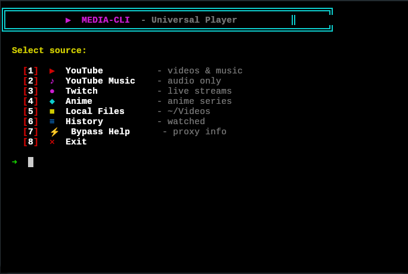

# media-cli

[](https://github.com/Sqrilizz/media-cli)
[](LICENSE)
[](https://www.rust-lang.org)

Universal CLI media player for YouTube, YouTube Music, Twitch, Anime, and local files.
For best experience use [kitty](https://github.com/kovidgoyal/kitty)

## Screenshot



## Quick Start

```bash
# Install (Linux/macOS)
curl -L https://raw.githubusercontent.com/sqrilizz/media-cli/main/media-cli -o media-cli
chmod +x media-cli
sudo mv media-cli /usr/local/bin/

# Run
media-cli
```

## Features

- 📺 **YouTube** - search and play videos
- 🎵 **YouTube Music** - audio-only mode for music
- 🔴 **Twitch** - live streams
- 🎌 **Anime** - anime via allanime API (like ani-cli)
- 📁 **Local Files** - play from ~/Videos
- 📜 **History** - track watched content
- 🎨 **Beautiful Interface** - colorful menu with borders
- 🔄 **Interactive Mode** - next/previous/replay/select
- 🌐 **Proxy Support** - bypass restrictions with auto-proxy detection

## Installation

### Method 1: Direct Download (Fastest) ⚡

Download pre-compiled binary directly from repository:

```bash
# One command install
curl -L https://raw.githubusercontent.com/sqrilizz/media-cli/main/media-cli -o media-cli && chmod +x media-cli && sudo mv media-cli /usr/local/bin/

# Or step by step
curl -L https://raw.githubusercontent.com/sqrilizz/media-cli/main/media-cli -o media-cli
chmod +x media-cli
sudo mv media-cli /usr/local/bin/
```

**Note:** Binary is for Linux x86_64. For other platforms, see Method 2 or 3.

### Method 2: Install Script

```bash
curl -fsSL https://raw.githubusercontent.com/sqrilizz/media-cli/main/install-direct.sh | bash
```

### Method 3: From GitHub Releases (All Platforms)

Download for your platform from [releases](https://github.com/sqrilizz/media-cli/releases/latest):

#### Linux (x86_64)
```bash
curl -L https://github.com/sqrilizz/media-cli/releases/latest/download/media-cli-linux-x86_64 -o media-cli
chmod +x media-cli
sudo mv media-cli /usr/local/bin/
```

#### macOS (Intel)
```bash
curl -L https://github.com/sqrilizz/media-cli/releases/latest/download/media-cli-macos-x86_64 -o media-cli
chmod +x media-cli
sudo mv media-cli /usr/local/bin/
```

#### macOS (Apple Silicon)
```bash
curl -L https://github.com/sqrilizz/media-cli/releases/latest/download/media-cli-macos-arm64 -o media-cli
chmod +x media-cli
sudo mv media-cli /usr/local/bin/
```

#### Windows
Download `media-cli-windows-x86_64.exe` from [releases](https://github.com/sqrilizz/media-cli/releases/latest) and add to PATH.

### Build from Source
```bash
git clone https://github.com/sqrilizz/media-cli
cd media-cli
cargo build --release
sudo cp target/release/media-cli /usr/local/bin/
```

## Usage

### Interactive Menu
```bash
media-cli
```

### Direct Commands
```bash
# YouTube video
media-cli yt "title"
media-cli yt "https://youtube.com/watch?v=..."

# YouTube Music (audio only)
media-cli music "song name"

# Twitch stream
media-cli twitch channel
media-cli twitch https://twitch.tv/channel

# Anime
media-cli anime "title"

# Local files
media-cli file
media-cli file /path/to/folder

# History
media-cli history
media-cli history --clear
```

## Dependencies

- `mpv` or `vlc` - video player
- `yt-dlp` - for YouTube
- `streamlink` - for Twitch
- `fzf` - for selection menu
- `curl` - for API requests

### Install All Dependencies

| Platform | Command |
|---|---|
| **Ubuntu/Debian** | `sudo apt install mpv yt-dlp streamlink fzf curl` |
| **Arch Linux** | `sudo pacman -S mpv yt-dlp streamlink fzf curl` |
| **Fedora** | `sudo dnf install mpv yt-dlp streamlink fzf curl` |
| **macOS** | `brew install mpv yt-dlp streamlink fzf curl` |
| **Windows** | Install each: [mpv](https://mpv.io) · [yt-dlp](https://github.com/yt-dlp/yt-dlp) · [streamlink](https://streamlink.github.io) · [fzf](https://github.com/junegunn/fzf) |

## Options

- `--proxy <URL>` - use proxy (or `auto` for auto-detection)
- `--terminal` / `-t` - play in terminal (kitty)
- `--quality <Q>` - video quality (720p, 1080p, best)
- `--player <P>` - choose player (mpv, vlc)
- `--gui` - graphical interface (ratatui)

## Examples

```bash
# Music in console
media-cli music "lofi hip hop"

# Anime with proxy
media-cli anime "naruto" --proxy http://proxy:8080

# YouTube in terminal
media-cli yt "music video" --terminal

# Twitch with quality
media-cli twitch streamer --quality 720p

# Auto proxy detection
media-cli --proxy auto yt "video"
```

## Feature Details

### YouTube Music
Plays audio only without video, perfect for background music:
- Minimal resource usage
- Progress bar in terminal
- Navigate between tracks

### Anime
Full provider implementation like ani-cli:
- Multiple provider support (Ak, S-mp4, Luf-Mp4, Yt-mp4)
- Automatic working provider selection
- Subtitles and quality options

### Interactive Mode
After playback:
- `replay` - replay current
- `next` - next item
- `previous` - previous item
- `select` - select another
- `quit` - exit

### Proxy & Bypass
- Auto-detect working proxies from `proxies.txt`
- Support for SOCKS5 and HTTP proxies
- DPI bypass integration (zapret/GoodbyeDPI)

## Configuration

Create `proxies.txt` in the current directory or `~/.config/media-cli/proxies.txt`:

```
# SOCKS5 proxies (one per line)
127.0.0.1:1080
socks5://proxy.example.com:1080

# HTTP proxies
http://proxy.example.com:8080
```

## License

MIT

---

## Documentation

- [README.md](README.md) - Main documentation
- [docs/EXAMPLES.md](docs/EXAMPLES.md) - Usage examples
- [docs/PROXY.md](docs/PROXY.md) - Proxy configuration
- [docs/HOW_TO_USE.md](docs/HOW_TO_USE.md) - User guide
- [docs/QUICK_REFERENCE.md](docs/QUICK_REFERENCE.md) - Command reference
- [CHANGELOG.md](CHANGELOG.md) - Version history

## For Developers

- [docs/CONTRIBUTING.md](docs/CONTRIBUTING.md) - Development guide
- [docs/GITHUB_RELEASE_SETUP.md](docs/GITHUB_RELEASE_SETUP.md) - Release setup
- [docs/START_HERE.md](docs/START_HERE.md) - Quick start for developers

## Project Structure

```
media-cli/
├── src/                    # Source code
│   ├── main.rs            # Main application
│   ├── cli.rs             # CLI argument parsing
│   ├── bypass.rs          # Proxy/bypass functionality
│   ├── player.rs          # Media player integration
│   ├── selector.rs        # Interactive selection (fzf)
│   ├── tui.rs             # Terminal UI (ratatui)
│   ├── history.rs         # Watch history
│   └── sources/           # Media source modules
│       ├── youtube.rs     # YouTube support
│       ├── anime.rs       # Anime support
│       ├── twitch.rs      # Twitch support
│       └── local.rs       # Local files
├── scripts/               # Installation scripts
│   ├── install.sh         # Main installer
│   └── install-direct.sh  # Direct binary installer
├── docs/                  # Documentation
├── .github/               # GitHub Actions workflows
├── media-cli              # Pre-compiled binary (Linux x86_64)
├── proxies.txt            # Proxy list (optional)
├── README.md              # This file
├── CHANGELOG.md           # Version history
└── LICENSE                # MIT License
```
