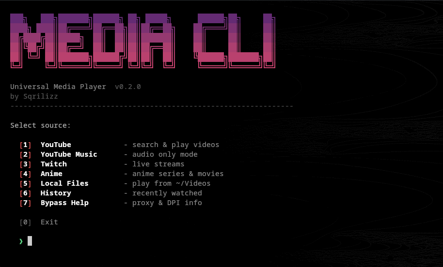

# media-cli

[](https://github.com/Sqrilizz/media-cli)
[](LICENSE)
[](https://www.rust-lang.org)

Universal CLI media player for YouTube, YouTube Music, Twitch, Anime, and local files.
Terminal-first interface with Catppuccin Mocha theme, CAVA-style visualizer, and keyboard-driven controls.

## Screenshot



## Quick Start

```bash
# Install app and all runtime dependencies (Linux/macOS)
curl -fsSL https://raw.githubusercontent.com/sqrilizz/media-cli/main/scripts/install.sh | bash

# Run
media-cli
```

## Features

- 📺 **YouTube** - search and play videos
- 🎵 **YouTube Music** - audio-only mode for music
- 🔴 **Twitch** - live streams
- 🎌 **Anime** - anime via allanime API (like ani-cli)
- 📁 **Local Files** - play from ~/Videos
- 📜 **History** - track watched content
- ⚙️ **Config** - defaults via `~/.config/media-cli/config.toml`
- 🎨 **Native TUI** - responsive keyboard-first interface powered by ratatui
- 🎚️ **Music Deck** - audio controls with progress bar and CAVA-style visualizer (BARS / MIRROR)
- 🔄 **Interactive Mode** - next/previous/replay/select

## Installation

### Method 1: Full Installer (Recommended) ⚡

Detects the platform, installs the only two runtime dependencies (`mpv` and `yt-dlp`), then installs the correct binary:

```bash
curl -fsSL https://raw.githubusercontent.com/sqrilizz/media-cli/main/scripts/install.sh | bash
```

### Method 2: Compatibility Installer

```bash
curl -fsSL https://raw.githubusercontent.com/sqrilizz/media-cli/main/scripts/install-direct.sh | bash
```

This entrypoint redirects to the same full installer and also installs all dependencies.

### Method 3: From GitHub Releases (All Platforms)

Download for your platform from [releases](https://github.com/sqrilizz/media-cli/releases/latest):

#### Linux (x86_64)

```bash
curl -L https://github.com/sqrilizz/media-cli/releases/latest/download/media-cli-linux-x86_64 -o media-cli
chmod +x media-cli
sudo mv media-cli /usr/local/bin/
```

#### Linux (ARM64)

```bash
curl -L https://github.com/sqrilizz/media-cli/releases/latest/download/media-cli-linux-arm64 -o media-cli
chmod +x media-cli
sudo mv media-cli /usr/local/bin/
```

#### macOS (Intel)

```bash
curl -L https://github.com/sqrilizz/media-cli/releases/latest/download/media-cli-macos-x86_64 -o media-cli
chmod +x media-cli
sudo mv media-cli /usr/local/bin/
```

#### macOS (Apple Silicon)

```bash
curl -L https://github.com/sqrilizz/media-cli/releases/latest/download/media-cli-macos-arm64 -o media-cli
chmod +x media-cli
sudo mv media-cli /usr/local/bin/
```

#### Windows

Download `media-cli-windows-x86_64.exe` from [releases](https://github.com/sqrilizz/media-cli/releases/latest) and add to PATH.

### Build from Source

```bash
git clone https://github.com/sqrilizz/media-cli
cd media-cli
cargo build --release
sudo cp target/release/media-cli /usr/local/bin/
```

## Usage

### Interactive Menu

```bash
media-cli
```

### Direct Commands

```bash
# YouTube video
media-cli yt "title"
media-cli yt "https://youtube.com/watch?v=..."

# YouTube Music (audio only)
media-cli music "song name"

# Twitch stream
media-cli twitch channel
media-cli twitch https://twitch.tv/channel

# Anime
media-cli anime "title"

# Local files
media-cli file
media-cli file /path/to/folder

# History
media-cli history
media-cli history --clear

# Settings
media-cli settings --init
media-cli settings --defaults
```

## Dependencies

- `mpv` or `vlc` - video player
- `yt-dlp` - for YouTube
- HTTP requests are handled natively inside media-cli
- Twitch streams are resolved through `yt-dlp`

### Install All Dependencies

| Platform | Command |
| --- | --- |
| **Ubuntu/Debian** | `sudo apt install mpv yt-dlp` |
| **Arch Linux** | `sudo pacman -S mpv yt-dlp` |
| **Fedora** | `sudo dnf install mpv yt-dlp` |
| **macOS** | `brew install mpv yt-dlp` |
| **Windows** | Install [mpv](https://mpv.io) and [yt-dlp](https://github.com/yt-dlp/yt-dlp) |

## Options

- `--terminal` / `-t` - play in terminal (mpv only), overrides config
- `--quality <Q>` - video quality (720p, 1080p, best), overrides config
- `--player <P>` - choose player (mpv, vlc), overrides config

## Configuration

Create a documented config file:

```bash
media-cli settings --init
```

Config path: `~/.config/media-cli/config.toml`.

Supported defaults include `player`, `quality`, `terminal`, `local_dir`, `anime_mode`, and Music Deck visualizer settings. See [docs/CONFIG.md](docs/CONFIG.md).

## Examples

```bash
# Music in console
media-cli music "lofi hip hop"

# YouTube in terminal
media-cli yt "music video" --terminal

# Twitch with quality
media-cli twitch streamer --quality 720p
```

## Feature Details

### YouTube Music

Plays audio only without video, perfect for background music:

- Minimal resource usage
- In-app controls for pause, mute and stop
- Configurable visualizer styles: `bars` (vertical CAVA-style) and `mirror` (symmetric)
- Press `V` during playback to toggle visualizer style

### Anime

Full provider implementation like ani-cli:

- Multiple provider support (Ak, S-mp4, Luf-Mp4, Yt-mp4)
- Automatic working provider selection
- Subtitles and quality options

### Interactive Mode

After playback:

- `replay` - replay current
- `next` - next item
- `previous` - previous item
- `select` - select another
- `quit` - exit

The main menu, search results, filtering, episode selection, and playback actions all use the same built-in interface. No external menu program is required.

## License

MIT

---

## Documentation

- [README.md](README.md) - Main documentation
- [docs/EXAMPLES.md](docs/EXAMPLES.md) - Usage examples
- [docs/HOW_TO_USE.md](docs/HOW_TO_USE.md) - User guide
- [docs/QUICK_REFERENCE.md](docs/QUICK_REFERENCE.md) - Command reference
- [docs/CONFIG.md](docs/CONFIG.md) - Configuration file reference
- [CHANGELOG.md](CHANGELOG.md) - Version history

## For Developers

- [docs/CONTRIBUTING.md](docs/CONTRIBUTING.md) - Development guide
- [docs/GITHUB_RELEASE_SETUP.md](docs/GITHUB_RELEASE_SETUP.md) - Release setup
- [docs/START_HERE.md](docs/START_HERE.md) - Quick start for developers

## Project Structure

```
media-cli/
├── src/                    # Source code
│   ├── main.rs            # Main application
│   ├── cli.rs             # CLI argument parsing
│   ├── player.rs          # Media player integration
│   ├── tui.rs             # Terminal UI (ratatui)
│   ├── history.rs         # Watch history
│   └── sources/           # Media source modules
│       ├── youtube.rs     # YouTube support
│       ├── anime.rs       # Anime support
│       ├── twitch.rs      # Twitch support
│       └── local.rs       # Local files
├── scripts/               # Installation scripts
│   ├── install.sh         # Main installer
│   └── install-direct.sh  # Compatibility installer
├── docs/                  # Documentation
├── .github/               # GitHub Actions workflows
├── README.md              # This file
├── CHANGELOG.md           # Version history
└── LICENSE                # MIT License
```
